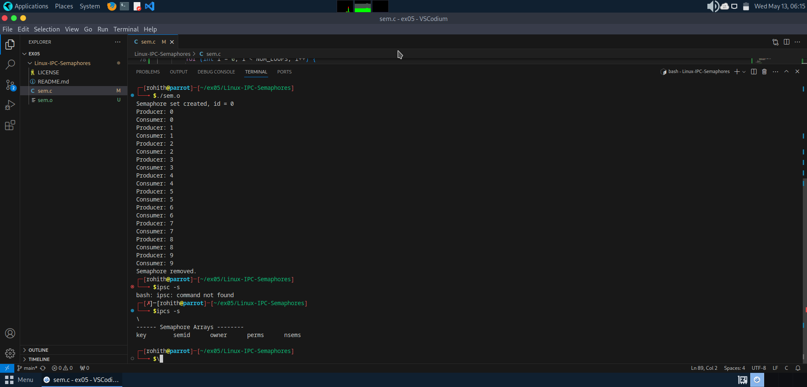

# Linux-IPC-Semaphores
Ex05-Linux IPC-Semaphores

# AIM:
To Write a C program that implements a producer-consumer system with two processes using Semaphores.

# DESIGN STEPS:

### Step 1:

Navigate to any Linux environment installed on the system or installed inside a virtual environment like virtual box/vmware or online linux JSLinux (https://bellard.org/jslinux/vm.html?url=alpine-x86.cfg&mem=192) or docker.

### Step 2:

Write the C Program using Linux Process API - Sempahores

### Step 3:

Execute the C Program for the desired output. 

# PROGRAM:

## Write a C program that implements a producer-consumer system with two processes using Semaphores.

~~~
// C program that implements a producer-consumer system with two processes using Semaphores.
/*
 * sem.c - Producer-Consumer using Semaphores
 */
#include <stdio.h>
#include <stdlib.h>
#include <unistd.h>
#include <sys/types.h>
#include <sys/ipc.h>
#include <sys/sem.h>
#include <sys/wait.h>
#include <time.h>

#define NUM_LOOPS 10  // Number of producer-consumer cycles

union semun {
    int val;
    struct semid_ds *buf;
    unsigned short int *array;
    struct seminfo *__buf;
};

// Wait (P operation)
void wait_semaphore(int sem_set_id) {
    struct sembuf sem_op = {0, -1, 0};
    if (semop(sem_set_id, &sem_op, 1) == -1) {
        perror("semop wait");
        exit(1);
    }
}

// Signal (V operation)
void signal_semaphore(int sem_set_id) {
    struct sembuf sem_op = {0, 1, 0};
    if (semop(sem_set_id, &sem_op, 1) == -1) {
        perror("semop signal");
        exit(1);
    }
}

int main() {
    int sem_set_id;
    union semun sem_val;
    int child_pid;

    // Create semaphore set
    sem_set_id = semget(IPC_PRIVATE, 1, 0600);
    if (sem_set_id == -1) {
        perror("semget");
        exit(1);
    }
    printf("Semaphore set created, id = %d\n", sem_set_id);

    // Initialize semaphore to 0
    sem_val.val = 0;
    if (semctl(sem_set_id, 0, SETVAL, sem_val) == -1) {
        perror("semctl");
        exit(1);
    }

    // Fork child
    child_pid = fork();
    if (child_pid < 0) {
        perror("fork");
        exit(1);
    }

    if (child_pid == 0) {
        // Consumer
        for (int i = 0; i < NUM_LOOPS; i++) {
            wait_semaphore(sem_set_id);
            printf("Consumer: %d\n", i);
            fflush(stdout);
        }
        exit(0);
    } else {
        // Producer
        for (int i = 0; i < NUM_LOOPS; i++) {
            printf("Producer: %d\n", i);
            fflush(stdout);
            signal_semaphore(sem_set_id);
            usleep(500000); // 0.5s delay
        }
        wait(NULL);
        semctl(sem_set_id, 0, IPC_RMID, sem_val);
        printf("Semaphore removed.\n");
    }
    return 0;
}
~~~

## OUTPUT
$ ./sem.o 

$ ipcs

# RESULT:
The program is executed successfully.
